# I Owe Who?
This project is a Django web-app for tracking expenses and IOUs with friends.

Users must sign up for an account in order to use this web-app.

## Screenshots:
<table width="100%">
  <thead>
    <tr>
      <th width="20%">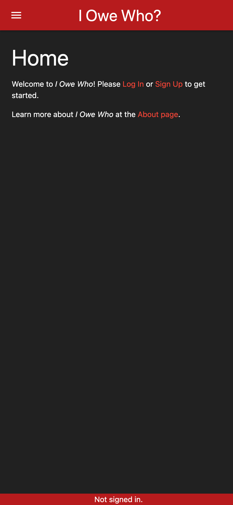</th>
      <th width="20%">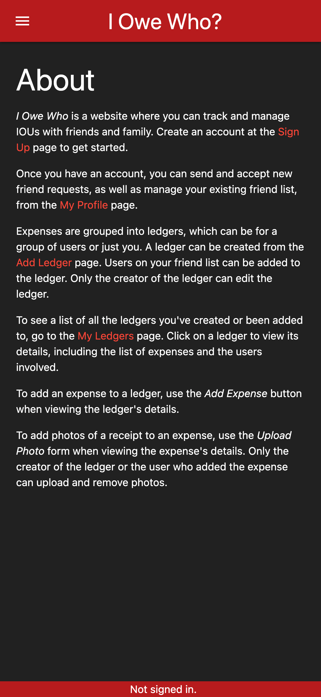</th>
      <th width="20%">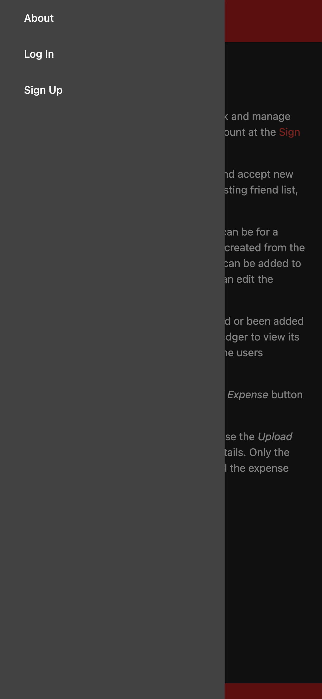</th>
      <th width="20%">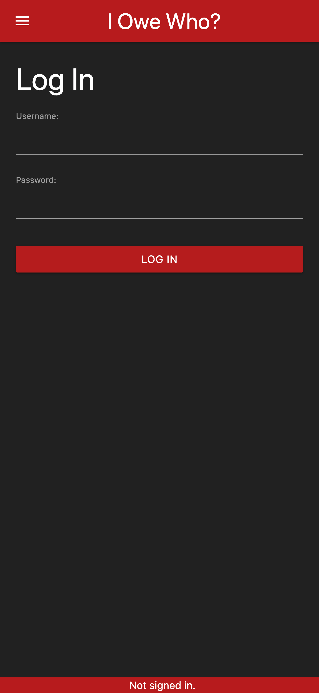</th>
      <th width="20%">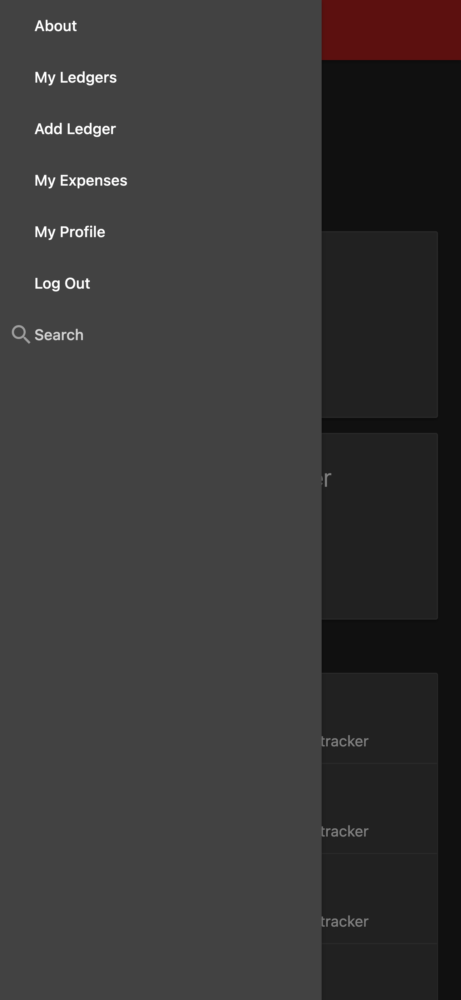</th>
    </tr>
  </thead>
  <tbody>
    <tr>
      <td width="20%" align="center">Home Page - Visitors</td>
      <td width="20%" align="center">About Page</td>
      <td width="20%" align="center">Navbar - Visitors</td>
      <td width="20%" align="center">Login Page</td>
      <td width="20%" align="center">Navbar - Users</td>
    </tr>
  </tbody>
</table>

<table width="100%">
  <thead>
    <tr>
      <th width="20%">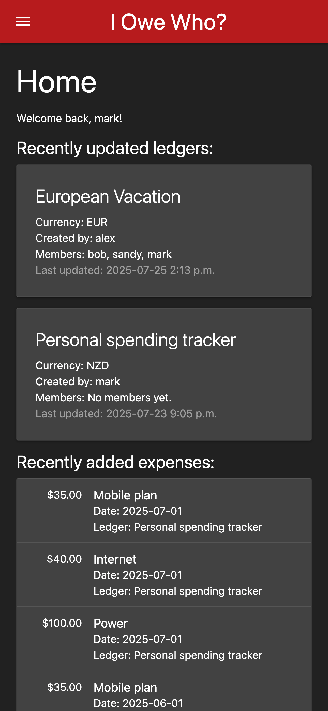</th>
      <th width="20%">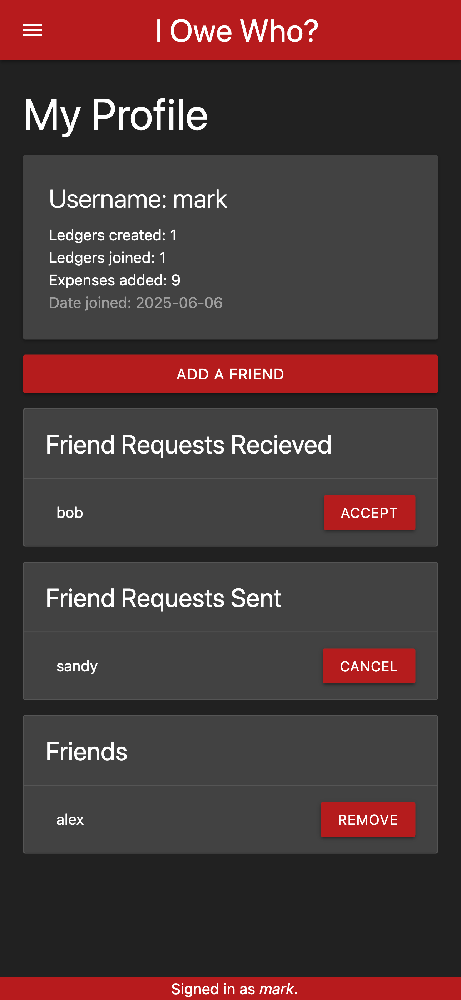</th>
      <th width="20%">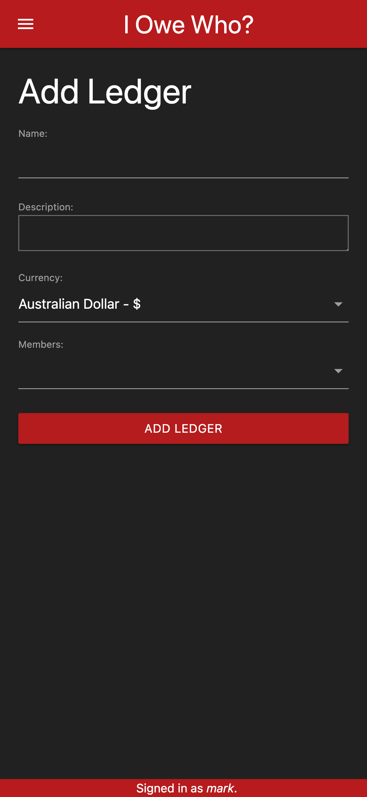</th>
      <th width="20%">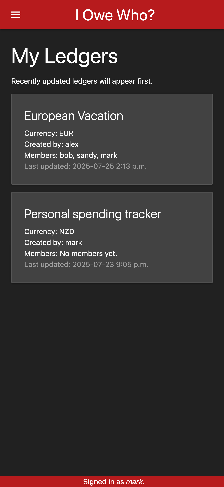</th>
      <th width="20%">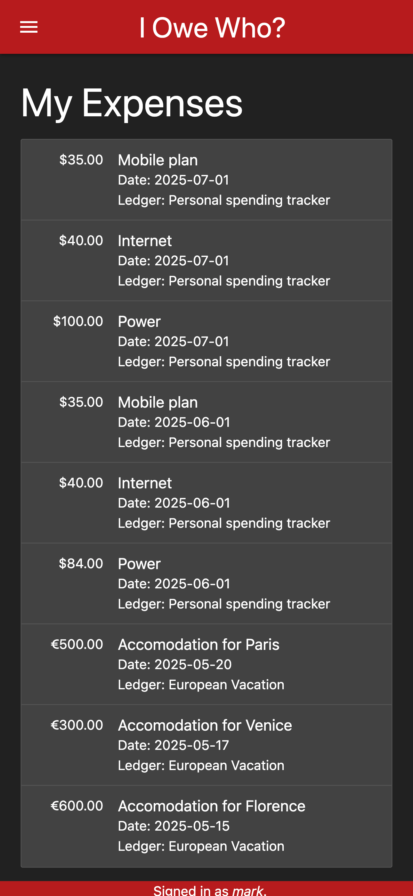</th>
    </tr>
  </thead>
  <tbody>
    <tr>
      <td width="20%" align="center">Home Page - Users</td>
      <td width="20%" align="center">My Profile Page</td>
      <td width="20%" align="center">Add Ledger Page</td>
      <td width="20%" align="center">My Ledgers Page</td>
      <td width="20%" align="center">My Expenses Page</td>
    </tr>
  </tbody>
</table>

<table width="100%">
  <thead>
    <tr>
      <th width="20%">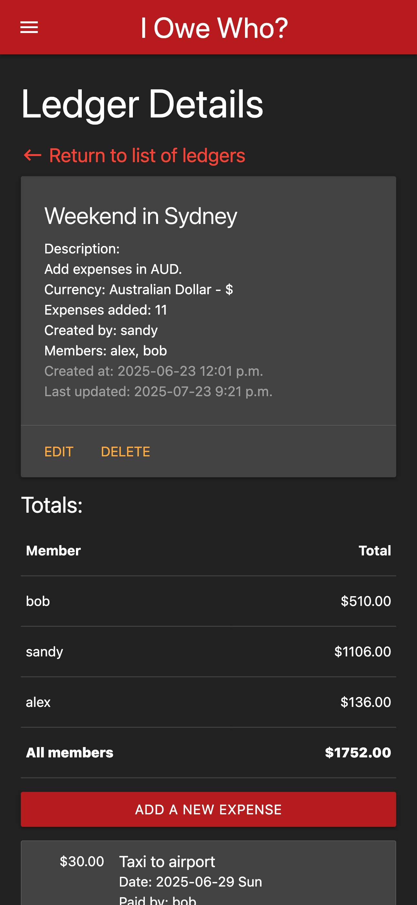</th>
      <th width="20%">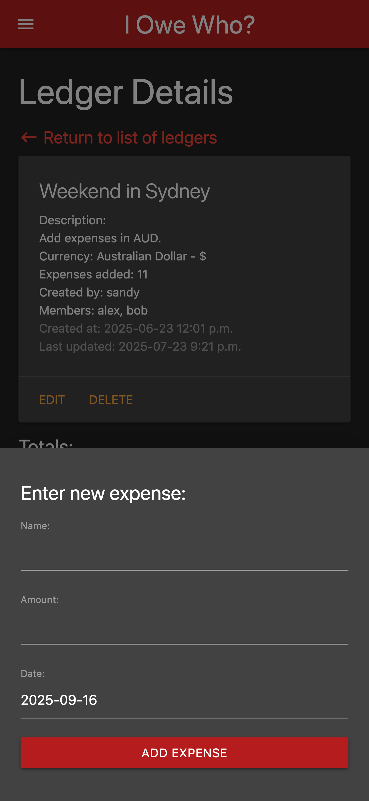</th>
      <th width="20%">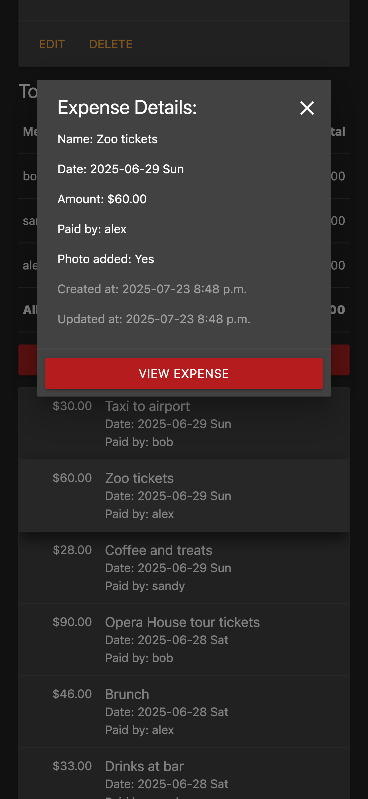</th>
      <th width="20%">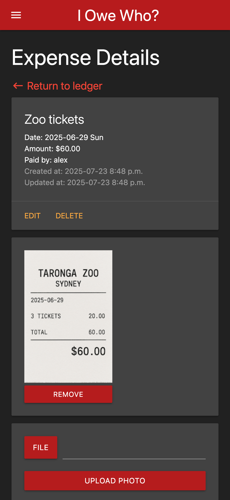</th>
      <th width="20%">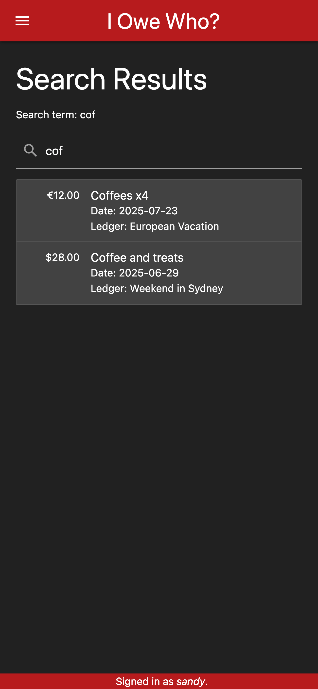</th>
    </tr>
  </thead>
  <tbody>
    <tr>
      <td width="20%" align="center">Ledger Detail Page</td>
      <td width="20%" align="center">Add Expense Form</td>
      <td width="20%" align="center">Expense Modal</td>
      <td width="20%" align="center">Expense Detail Page</td>
      <td width="20%" align="center">Search Page</td>
    </tr>
  </tbody>
</table>

## Technologies Used:
* __Django__: to run the backend server.
* __Django Template Language (DTL)__: for the frontend pages.
* __PostgreSQL__: for the database.
* __Materialize__: to achieve the CSS layout.
* __Amazon AWS S3__: to persist images added to expenses.

## Getting Started:
<!-- [Try the live website here.](...) -->
There is currently no live website.

The project was planned out in a Trello board, view it on Trello [here.](https://trello.com/b/zIVdZxFT/i-owe-who-project-planning)

The Entity Relationship Diagram (ERD) was made using [Lucid Chart](https://www.lucidchart.com) and can be seen in the Trello board.

Wireframes of the different pages were made using [wireframe|cc](https://wireframe.cc/) and can be seen in the Trello board.

## Future Development:
* Create a hosted version of the web-app and database.
* Show summary of spending for the user by month.
* Show summary of spending for the user by ledger.

## Known Bugs:
No known bugs at this time.

## Acknowledgements:
The favicon was created using [favicon.cc](https://www.favicon.cc/).